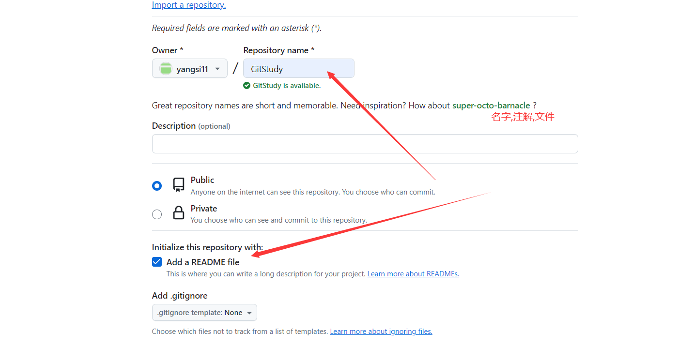
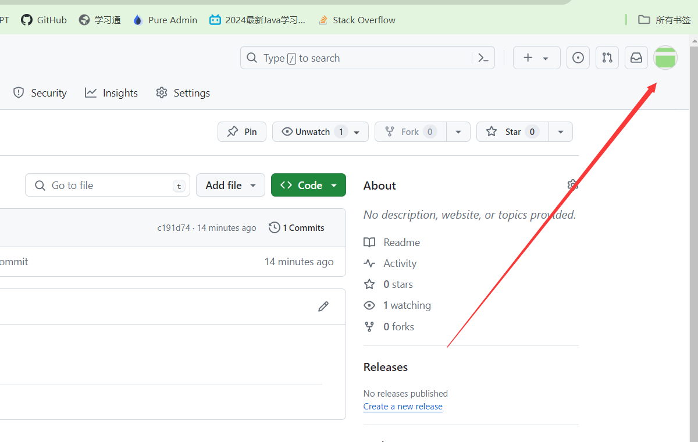
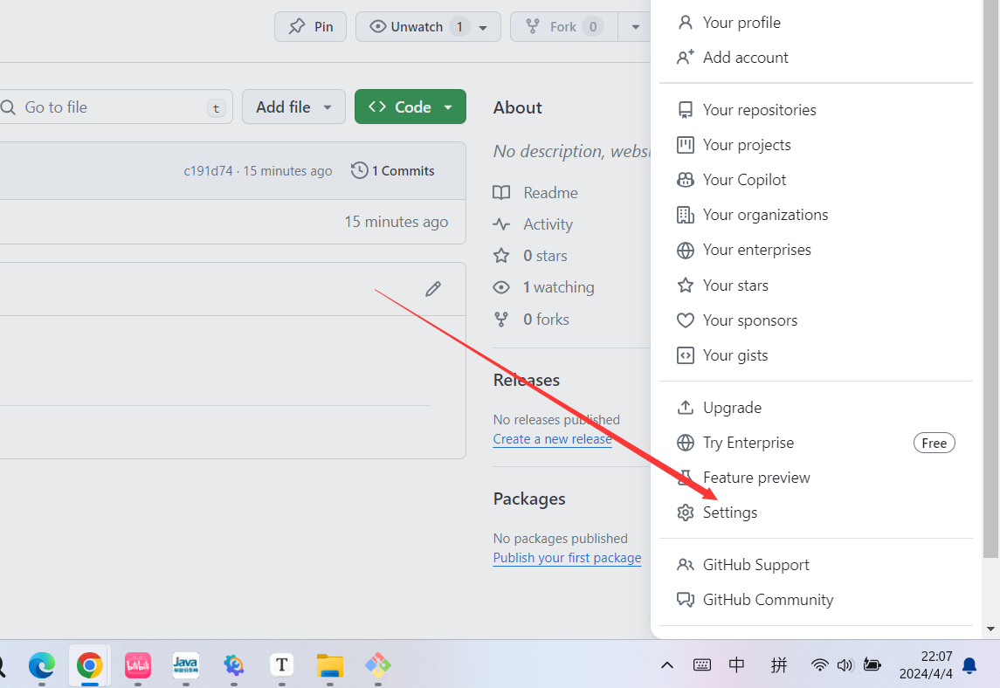
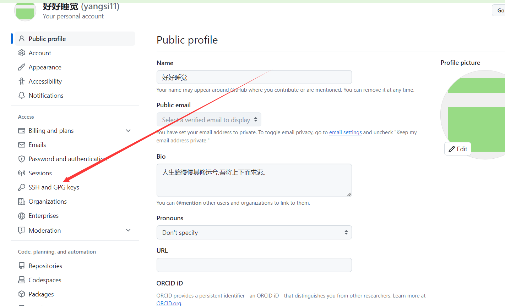
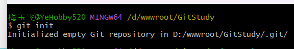
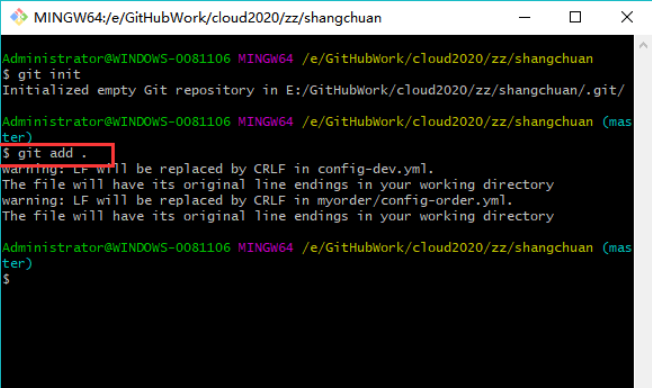
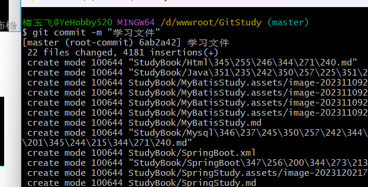
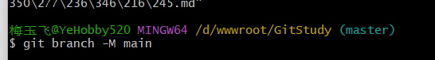
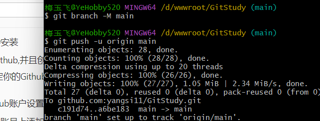

GitStudy

### 一、先学会安装

网站地址:https://blog.csdn.net/mukes/article/details/115693833


### 二、注册Github,并且创建Repository


​	



点击创建项目即可

### 三、Git绑定你的Github的项目邮箱,账户(用于识别)


**绑定邮箱和名字**

```bash
git config --global user.name "yangtianfei"
git config --global user.emil "2918514049@qq.com"
```


### 四、为Github账户设置SSH key

```bash
ssh-keygen -t rsa -C "2918514049@qq.com"
//执行后一直回车即可
```

第三步：获取ssh key公钥内容（id_rsa.pub）

```
cd ~/.ssh
cat id_rsa.pub
```


**全部用默认三次回车就可以了**


### 五、Github账号上添加公钥







**复制进去添加就行**


最后验证是否添加成功

```bash
ssh -T git@github.com
```

验证登入成功


克隆github上的代码

```bash
git clone "地址"
```


### 六、初始化Git,创建文件,并且上传

#### 1.初始化 git init

```bash
git init	
```



#### 2. 输入 `git add .` 将项目添加到暂存区

- 注意： **.** 前面有空格，代表添加所有文件。

- 若添加单个文件输入：`git add xxxx.xx`（xxxx.xx为文件名）

	```bash
	git add .
	```

	



#### 3.输入 `git commit -m "注释内容"` 将项目提交到Git仓库

```bash
git commit -m "注释内容"	
```



#### 4.创建分支`git branch -M main`

```bash
git branch -M main
```



#### 5.输入：`git remote add origin https://github.com/xxxxx/test.git`，和远程仓库连接

```bash
git remote add origin git@github.com:yangsi11/GitStudy.git
```

#### 6.将本地项目推送到远程仓库



```bash
git push -u origin main
```


#### 7.实现项目文件更新

这个错误表明 Git 无法解析主机名 `github.com`。这可能是因为网络连接问题或配置错误导致的。

你可以尝试以下步骤来解决这个问题：

1. **检查网络连接：** 确保你的网络连接正常。尝试打开一个浏览器并访问 `github.com`，看看是否能够正常打开 GitHub 网站。

2. **检查 SSH 配置：** 如果你使用 SSH 进行推送到 GitHub，确保你的 SSH 配置正确。你可以尝试运行以下命令来测试 SSH 连接是否正常：
   ```
   ssh -T git@github.com
   ```
   如果一切正常，你应该会看到一条欢迎消息。

3. **检查远程仓库 URL：** 使用 `git remote -v` 命令查看远程仓库的 URL 是否设置正确。如果 URL 不正确，可以使用 `git remote set-url` 命令来修改：
   ```
   git remote set-url origin <正确的远程仓库URL>
   ```

4. **尝试使用 HTTPS 连接：** 如果使用 SSH 仍然出现问题，你可以尝试使用 HTTPS 连接。首先，移除现有的远程 URL：
   ```
   git remote rm origin
   ```
   然后，添加 HTTPS 连接的远程 URL：
   ```
   git remote add origin https://github.com/你的用户名/你的仓库名.git
   ```
   用你的 GitHub 用户名和仓库名替换命令中的占位符。

如果你尝试了上述步骤仍然无法解决问题，可能需要进一步调查网络连接或配置问题。

如果你的本地仓库已经发生了改变，你可以执行以下步骤将这些更改推送到 GitHub 上：

1. **添加更改到暂存区：** 使用 `git add` 命令将你想要推送的更改添加到 Git 的暂存区。例如：
   ```
   git add .
   ```

   这将添加所有更改到暂存区。如果你只想添加特定文件，可以使用文件路径代替 `.`。

2. **提交更改到本地仓库：** 使用 `git commit` 命令将暂存区的更改提交到你的本地仓库。例如：
   ```
   git commit -m "描述你的更改"
   ```

   在 `-m` 后面输入一条简短的消息来描述你的更改。

3. **推送更改到 GitHub：** 使用 `git push` 命令将你的本地更改推送到 GitHub 上。由于你之前已经使用 `-u` 标志来建立上游连接，因此只需执行：
   ```
   git push
   ```

   如果你在之前的推送操作中设置了其他参数，你也可以再次使用它们。

这样，你的本地更改就会被推送到 GitHub 上的相应分支，并与远程仓库同步。


# 总结报错

报错一定是要在创建的.git下面的文件进行操作

