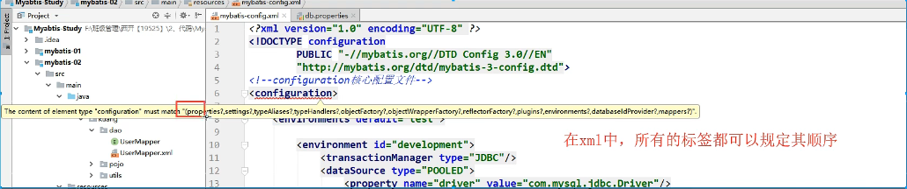
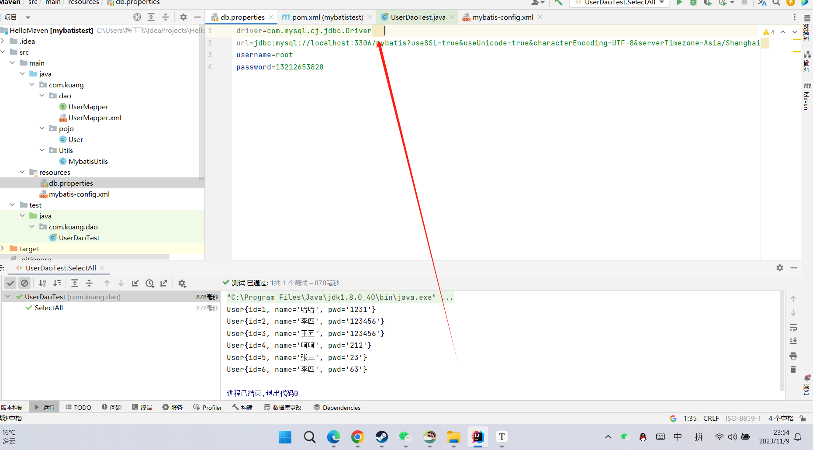
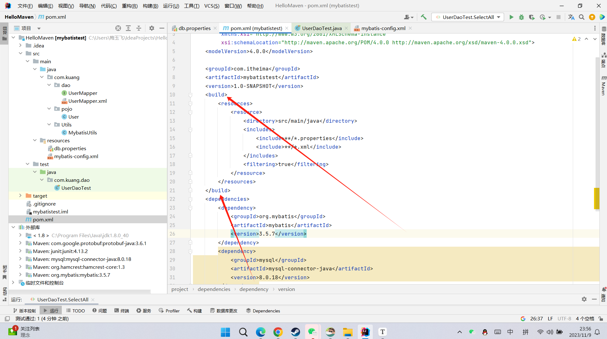

 MyBatis01：第一个程序


# 1.MyBatis简介


> 环境说明：

- jdk 8 +
- MySQL 5.7.19
- maven-3.6.1
- IDEA

学习前需要掌握：

- JDBC
- MySQL
- Java 基础
- Maven
- Junit

> 什么是MyBatis

- MyBatis 是一款优秀的**持久层框架**
- MyBatis 避免了几乎所有的 JDBC 代码和手动设置参数以及获取结果集的过程
- MyBatis 可以使用简单的 XML 或注解来配置和映射原生信息，将接口和 Java 的 实体类 【Plain Old Java Objects,普通的 Java对象】映射成数据库中的记录。
- MyBatis 本是apache的一个开源项目ibatis, 2010年这个项目由apache 迁移到了google code，并且改名为MyBatis 。
- 2013年11月迁移到**Github** .
- Mybatis官方文档 : http://www.mybatis.org/mybatis-3/zh/index.html
- GitHub : https://github.com/mybatis/mybatis-3

> 持久化

## **持久化是将程序数据在持久状态和瞬时状态间转换的机制。**

- 即把数据（如内存中的对象）保存到可永久保存的存储设备中（如磁盘）。持久化的主要应用是将内存中的对象存储在数据库中，或者存储在磁盘文件中、XML数据文件中等等。
- JDBC就是一种持久化机制。文件IO也是一种持久化机制。
- 在生活中 : 将鲜肉冷藏，吃的时候再解冻的方法也是。将水果做成罐头的方法也是。

## **为什么需要持久化服务呢？那是由于内存本身的缺陷引起的**

- 内存断电后数据会丢失，但有一些对象是无论如何都不能丢失的，比如银行账号等，遗憾的是，人们还无法保证内存永不掉电。
- 内存过于昂贵，与硬盘、光盘等外存相比，内存的价格要高2~3个数量级，而且维持成本也高，至少需要一直供电吧。所以即使对象不需要永久保存，也会因为内存的容量限制不能一直呆在内存中，需要持久化来缓存到外存。

> 持久层

## **什么是持久层？**

- 完成持久化工作的代码块 .  ---->  dao层 【DAO (Data Access Object)  数据访问对象】
- 大多数情况下特别是企业级应用，数据持久化往往也就意味着将内存中的数据保存到磁盘上加以固化，而持久化的实现过程则大多通过各种**关系数据库**来完成。
- 不过这里有一个字需要特别强调，也就是所谓的“层”。对于应用系统而言，数据持久功能大多是必不可少的组成部分。也就是说，我们的系统中，已经天然的具备了“持久层”概念？也许是，但也许实际情况并非如此。之所以要独立出一个“持久层”的概念,而不是“持久模块”，“持久单元”，也就意味着，我们的系统架构中，应该有一个相对独立的逻辑层面，专注于数据持久化逻辑的实现.
- 与系统其他部分相对而言，这个层面应该具有一个较为清晰和严格的逻辑边界。【说白了就是用来操作数据库存在的！】

> 为什么需要Mybatis

- Mybatis就是帮助程序猿将数据存入数据库中 , 和从数据库中取数据 .

- 传统的jdbc操作 , 有很多重复代码块 .比如 : 数据取出时的封装 , 数据库的建立连接等等... , 通过框架可以减少重复代码,提高开发效率 .

- MyBatis 是一个半自动化的**ORM框架 (Object Relationship Mapping) -->对象关系映射**

- 所有的事情，不用Mybatis依旧可以做到，只是用了它，所有实现会更加简单！**技术没有高低之分，只有使用这个技术的人有高低之别**

- MyBatis的优点

- - 简单易学：本身就很小且简单。没有任何第三方依赖，最简单安装只要两个jar文件+配置几个sql映射文件就可以了，易于学习，易于使用，通过文档和源代码，可以比较完全的掌握它的设计思路和实现。
	- 灵活：mybatis不会对应用程序或者数据库的现有设计强加任何影响。sql写在xml里，便于统一管理和优化。通过sql语句可以满足操作数据库的所有需求。
	- 解除sql与程序代码的耦合：通过提供DAO层，将业务逻辑和数据访问逻辑分离，使系统的设计更清晰，更易维护，更易单元测试。sql和代码的分离，提高了可维护性。
	- 提供xml标签，支持编写动态sql。
	- .......

- 最重要的一点，使用的人多！公司需要！


MyBatis第一个程序


# **思路流程：搭建环境-->导入Mybatis--->编写代码--->测试**

> 代码演示

### 1、搭建实验数据库

```sql
CREATE DATABASE `mybatis`;

USE `mybatis`;

DROP TABLE IF EXISTS `user`;

CREATE TABLE `user` (
`id` int(20) NOT NULL,
`name` varchar(30) DEFAULT NULL,
`pwd` varchar(30) DEFAULT NULL,
PRIMARY KEY (`id`)
) ENGINE=InnoDB DEFAULT CHARSET=utf8;

insert  into `user`(`id`,`name`,`pwd`) values (1,'狂神','123456'),(2,'张三','abcdef'),(3,'李四','987654');
```

### 2、导入MyBatis相关 jar 包

- GitHub上找

```xml
 <dependencies>
        <dependency>
            <groupId>org.mybatis</groupId>
            <artifactId>mybatis</artifactId>
            <version>3.5.7</version>
        </dependency>
        <dependency>
            <groupId>mysql</groupId>
            <artifactId>mysql-connector-java</artifactId>
            <version>8.0.33</version>
        </dependency>
        <dependency>
            <groupId>junit</groupId>
            <artifactId>junit</artifactId>
            <version>4.13.2</version>
            <scope>compile</scope>
        </dependency>
    </dependencies>
```

### 3、编写MyBatis核心配置文件

- 查看帮助文档

```xml
<?xml version="1.0" encoding="UTF-8" ?>
<!DOCTYPE configuration
        PUBLIC "-//mybatis.org//DTD Config 3.0//EN"
        "http://mybatis.org/dtd/mybatis-3-config.dtd">
<configuration>
    <environments default="development">
        <environment id="development">
            <transactionManager type="JDBC"/>
            <dataSource type="POOLED">
                <property name="driver" value="com.mysql.cj.jdbc.Driver"/>
                <property name="url" value="jdbc:mysql://localhost:3306/mybatis?useSSL=true&amp;useUnicode=true&amp;characterEncoding=utf8&amp;serverTimezone=UTC"/>
                <property name="username" value="root"/>
                <property name="password" value="13212653820"/>
            </dataSource>
        </environment>
    </environments>
    <mappers>
        <mapper resource="com/kuang/dao/UserMapper.xml"/>
    </mappers>
</configuration>
```

### 4、编写MyBatis工具类

- 查看帮助文档

```java
package com.kuang.Utils;

import  org.apache.ibatis.io.Resources;
import org.apache.ibatis.io.Resources;
import org.apache.ibatis.session.SqlSession;
import org.apache.ibatis.session.SqlSessionFactory;
import org.apache.ibatis.session.SqlSessionFactoryBuilder;
import java.io.IOException;
import java.io.InputStream;

public class MybatisUtils {

    private static SqlSessionFactory sqlSessionFactory;

    static {
        try {
            String resource = "mybatis-config.xml";
            InputStream inputStream = Resources.getResourceAsStream(resource);
            sqlSessionFactory = new SqlSessionFactoryBuilder().build(inputStream);
        } catch (IOException e) {
            e.printStackTrace();
        }
    }

    //获取SqlSession连接
    public static SqlSession getSession(){
        return sqlSessionFactory.openSession();
    }

}
```

### 5、创建实体类

```java
package com.kuang.pojo;

public class User {

    private int id;  //id
    private String name;   //姓名
    private String pwd;   //密码

    //构造,有参,无参
    //set/get
    //toString()

    public User() {
    }

    public User(int id, String name, String pwd) {
        this.id = id;
        this.name = name;
        this.pwd = pwd;
    }

    public int getId() {
        return id;
    }

    public void setId(int id) {
        this.id = id;
    }

    public String getName() {
        return name;
    }

    public void setName(String name) {
        this.name = name;
    }

    public String getPwd() {
        return pwd;
    }

    public void setPwd(String pwd) {
        this.pwd = pwd;
    }

    @Override
    public String toString() {
        return "User{" +
                "id=" + id +
                ", name='" + name + '\'' +
                ", pwd='" + pwd + '\'' +
                '}';
    }
}
```

### 6、编写Mapper接口类

```java
package com.kuang.dao;

import com.kuang.pojo.User;
import java.util.List;

public interface UserDao {
    List<User> getUserList();
}
```

### 7、编写Mapper.xml配置文件

- namespace 十分重要，不能写错！

```xml
<?xml version="1.0" encoding="UTF-8" ?>
<!DOCTYPE mapper
        PUBLIC "-//mybatis.org//DTD Mapper 3.0//EN"
        "http://mybatis.org/dtd/mybatis-3-mapper.dtd">
<mapper namespace="com.kuang.dao.UserDao">
    <select id="getUserList" resultType="com.kuang.pojo.User">
        select * from user 
    </select>
</mapper>
```

### 8、编写测试类

- Junit 包测试

```java
package com.kuang.dao;


import com.kuang.Utils.MybatisUtils;
import com.kuang.pojo.User;
import org.apache.ibatis.session.SqlSession;
import org.junit.Test;

import java.util.List;

public class UserDaoTest {
    @Test
    public void test() {
        SqlSession sqlSession = MybatisUtils.getSession();

        UserDao userDao = sqlSession.getMapper(UserDao.class);
        List<User> userList = userDao.getUserList();
        for (User user : userList) {
            System.out.println(user);
        }
    }
}


```

9、运行测试，成功的查询出来的我们的数据，ok！


> 问题说明

### **可能出现问题说明：Maven静态资源过滤问题**

```xml
 <build>
        <resources>
            <resource>
                <directory>HelloMaven/src/main/resources</directory>
                <excludes>
                    <exclude>**/*.properties</exclude>
                    <exclude>**/*.xml</exclude>
                </excludes>
                <filtering>false</filtering>
            </resource>
            <resource>
                <directory>src/main/java</directory>
                <includes>
                    <include>**/*.properties</include>
                    <include>**/*.xml</include>
                </includes>
                <filtering>false</filtering>
            </resource>
        </resources>

</build>
```

# 2.CRUD增删改查

## 1.namespace

namespace中的包名要和Dao/mapper中的名字一致

## 2.select 

选择,查询语句 

- id:就是对应的namespace中的方法名
- resultType:Sql语句的返回值!
- parametertType:参数类型 

1.缩写接口

```java
//根据id查询用户
    User getUserById(int id);
```

2.缩写接口对应的mapper中的sql语句

```java
 <select id="getUserById"  parameterType="int" resultType="com.kuang.pojo.User">
     select * from user where id=#{id}
</select>
```

3.测试

```java
 @Test
    public void getUserById() {
        SqlSession sqlSession = MybatisUtils.getSession();
        UserMapper mapper = sqlSession.getMapper(UserMapper.class);
        User user = mapper.getUserById(1);
        System.out.println(user);
        sqlSession.close();
    }
```

## 3.insert

```java
 @Test
    public void addUser() {
        SqlSession sqlSession = MybatisUtils.getSession();
        UserMapper mapper = sqlSession.getMapper(UserMapper.class);
        int res = mapper.addUser(new User(4, "哈哈", "1231"));
        if (res > 0) {
            System.out.println("插入成功!");
        }
        sqlSession.commit();
        //提交事务
        sqlSession.close();
    }
```


## 4.update

```java
 @Test
    public void updateUser() {
        SqlSession sqlSession = MybatisUtils.getSession();
        UserMapper mapper = sqlSession.getMapper(UserMapper.class);
        int  res=mapper.updateUser(new User(4, "呵呵", "212"));
        if (res > 0) {
            System.out.println("修改成功!");
        }
        sqlSession.commit();
        sqlSession.close();
    }
```


## 5.delete

```java
 @Test
    public void deleteUser(){
        SqlSession sqlSession=MybatisUtils.getSession();
        UserMapper mapper=sqlSession.getMapper(UserMapper.class);
        int res=mapper.deleteUser(1);
        if (res>0){
            System.out.println("删除成功");
        }
        sqlSession.commit();
        sqlSession.close();
    }
```

## 6.分析错误	

- 标签不要搞错

- mybatis-config.xml中的mapper是/的,resource中的资源路径是斜杠

- 程序配置文件必须符合规范xml文件

- NullPointerException空指针异常,没有注册到资源

- Maven资源没有到处问题

	```java
	 <build>
	        <resources>
	            <resource>
	                <directory>HelloMaven/src/main/resources</directory>
	                <excludes>
	                    <exclude>**/*.properties</exclude>
	                    <exclude>**/*.xml</exclude>
	                </excludes>
	                <filtering>false</filtering>
	            </resource>
	            <resource>
	                <directory>src/main/java</directory>
	                <includes>
	                    <include>**/*.properties</include>
	                    <include>**/*.xml</include>
	                </includes>
	                <filtering>false</filtering>
	            </resource>
	        </resources>
	
	    </build>
	```

	

## 7.万能Mapper方法


假设我们的实体类,或者数据库中的表,字段或者参数过多,我们应当考虑使用Map! 

```java
int addUser2(Map<String,Object> map);
```

```xml
   <insert id="addUser2" parameterType="map">
        insert into mybatis.user(id,name,pwd) values (#{userid} ,#{username},#{password});
    </insert>
```

```java
  @Test
    public void addUser2(){
        SqlSession sqlSession=MybatisUtils.getSession();
        UserMapper mapper=sqlSession.getMapper(UserMapper.class);
        Map<String,Object> map=new HashMap<String, Object>();
        map.put("userid",5);
        map.put("username","hello");
        map.put("password","222333");

        mapper.addUser2(map);
        sqlSession.close();
    }
```

Map传递参数，直接在sql中取出key即可!

[parameterType="map"]对象传递参数，直接在sql中取对象的属性即可!

[parameterType="Object”]只有一个基本类型参数的情况下，可以直接在sql中取到!

多个参数用Map，或者注解!

## 8.思考题

模糊查询怎么写?

java执行代码的时候,传递通配符要% %

```java
 List<User> userList=mapper.getUserLike("%张%");
```

2.在sql中拼接中使用通配符!

```java
select * from mybatis.user where name like "%"#[value}"%"
```

# 3.配置解析

## 1.核心配置文件

- mybatis-config.xml

- MyBatis 的配置文件包含了会深深影响 MyBatis 行为的设置和属性信息。 配置文档的顶层结构如下：

- ```java
	configuration（配置）
	properties（属性）
	settings（设置）
	typeAliases（类型别名）
	typeHandlers（类型处理器）
	objectFactory（对象工厂）
	plugins（插件）
	environments（环境配置）
	environment（环境变量）
	transactionManager（事务管理器）
	dataSource（数据源）
	databaseIdProvider（数据库厂商标识）
	mappers（映射器）
	```


## 2、环境配置 (environments)

MyBatis可以配置成适应多种环境
**不过要记住:尽管可以配置多个环境，但每个SqlSessionFactory 实例只能选择一种环境。**
学会使用配置多套运行环境!
Mybatis默认的事务管理器就是JDBC，连接池: POOLED

## 3.属性(properties)

我们可以通过properties属性来实现引用配置文件

既可以在典型的Java属性文件中配置，亦可通过properties这些属性都是可外部配置且可动态替换的，元素的子元素来传递。[db.properties]


编写一个配置文件(有顺序)

 db.properties

```properties
driver=com.mysql.cj.jdbc.Driver  
url=jdbc:mysql://localhost:3306/mybatis?useSSL=true&useUnicode=true&characterEncoding=UTF-8&serverTimezone=Asia/Shanghai
username=root  
password=13212653820
```

### 超级无敌大bug

#### 1.有空格会报错,一定要注意



2.注意要在propertits里面加builder,不然不会读取资源库



3.版本高了要配置mysql的时区,还有文本语言

```java
url=jdbc:mysql://localhost:3306/mybatis?useSSL=true&useUnicode=true&characterEncoding=UTF-8&serverTimezone=Asia/Shanghai
```

4.在核心配置引入外部文件

- 有外部文件先引入外部文件添加一些属性配置
- 如果有两个文件优先使用外部文件
- 可以在其中适当

## 4 类型别名（typeAliases）

- 类型别名是为Java类型设置一个短的名字。
- 存在的意义仅在于用来减少类完全限定名的冗余。

```xml
<!--可以给实体类起别名-->
<typeAliases>
    <typeAlias type="com.kuang.pojo.User" alias="User" />
</typeAliases>
```

也可以指定一个包名，MyBatis会在包名下面搜索需要的JavaBean，比如：扫描实体类的包，它的默认别名就为这个类的类名，首字母小写！

```xml
<!--可以给实体类起别名-->
<typeAliases>
    <package name="com.kuang.pojo"/>
</typeAliases>
```
在实体类比较少的时候，使用第一种方式。
如果实体类十分多，建议使用第二种。
第一种可以DIY别名，第二种则不行，如果非要改，需要在实体上增加注解

```java
@Alias("user")
//实体类
public class User {}
```

## 5 设置

这是MyBatis中极为重要的调整设置，它们会改变MyBatis的运行时行为。


## 6.映射器

MapperRegistry：注册绑定我们的Mapper文件；

方式一：【推荐使用】

 

```xml
*<!--每一个Mapper.xml都需要在Mybatis核心配置文件中注册！-->*   
<mappers>    
    <mapper resource="com/kuang/dao/UserMapper.xml"/>   
</mappers>
```

方式二:使用class文件绑定注册

```xml
  *<!--每一个Mapper.xml都需要在Mybatis核心配置文件中注册！-->*  
<mappers>   
      <mapper class="com.kuang.dao.UserMapper"/>  
</mappers>
```

注意点：

- 接口和它的Mapper配置文件必须同名！
- 接口和它的Mapper配置文件必须在同一个包下!

方式三：使用扫描包进行注入绑定

```xml
 <mappers>
        <package name="com.kuang.dao"/>
</mappers>
```

注意点：

- 接口和它的Mapper配置文件必须同名！
- 接口和它的Mapper配置文件必须在同一个包下!

5.解决属性名和字段名不一致的问题

# 4.结果集映射

```java
id name pwd
id name password
```

```java
    <!--  结果集映射  -->
    <resultMap id="UserMap" type=" User">
        <!--column数据库中的字段，property实体类中的属性-->
        <result column="id" property="id" />
        <result column="name" property="name" />
        <result column="pwd" property="password" />
    </resultMap>

    <select id="getUserById" parameterType="int" resultMap="UserMap">
        select * from mybatis.user where id = #{id}
    </select>

```

- resultMap 元素是 MyBatis 中最重要最强大的元素。
- ResultMap 的设计思想是，对简单的语句做到零配置，对于复杂一点的语句，只需要描述语句之间的关系就行了。
- ResultMap 的优秀之处——你完全可以不用显式地配置它们。
- 如果这个世界总是这么简单就好了。

# 5.日志是一个很好的工具

## 5.1日志工厂

如果一个数据库操作出现了问题异常,我们需要排错,日子就是最好的助手!

曾经:sout,debug

现在:5.1日志工厂


- SLF4J
- LOG4J 【掌握】
- LOG4J2
- JDK_LOGGING
- COMMONS_LOGGING
- STDOUT_LOGGING【掌握】
- NO_LOGGING

在Mybatis中具体使用哪一个日志实现，在设置中设定！

**STDOUT_LOGGING**标准日志输出
在mybatis-config.xml核心配置文件中，配置我们的日志！

```xml
  <settings>     
  <setting name="logImpl"  value="STDOUT_LOGGING"/> 
  </settings>
```


## 5.2 Log4j

- Log4j是Apache的一个开源项目，通过使用Log4j，我们可以控制日志信息输送的目的地是控制台、文件、GUI组件
- 我们也可以控制每一条日志的输出格式；
- 通过定义每一条日志信息的级别，我们能够更加细致地控制日志的生成过程。
- 可以通过一个配置文件来灵活地进行配置，而不需要修改应用的代码。

```xml
 <dependencies>
        <!--https://mvnrepository.com/artifact/log4j/log4j -->
        <dependency>
            <groupId>log4j</groupId>
            <artifactId>log4j</artifactId>
            <version>1.2.17</version>
        </dependency>
    </dependencies>

```

2.在resources文件夹下建立log4j.properties文件进行配置

```java
#将等级为DEBUG的日志信息输出到console和file这两个目的地，console和file的定义在下面的代码
log4j.rootLogger = DEBUG,console,file

#控制台输出的相关设置
log4j.appender.console = org.apache.log4j.ConsoleAppender
log4j.appender.console.Target = System.out
log4j.appender.console.Threshold = DEBUG
log4j.appender.console.layout = org.apache.log4j.PatternLayout
log4j.appender.console.layout.ConversionPattern =  [%c]-%m%n

#文件输出的相关设置
log4j.appender.file = org.apache.log4j.RollingFileAppender
log4j.appender.file.File = ./log/kuang.log
log4j.appender.file.MaxFileSize = 10mb
log4j.appender.file.Threshold = DEBUG
log4j.appender.file.layout = org.apache.log4j.PatternLayout
log4j.appender.file.layout.ConversionPattern = [%p][%d{yy-MM-dd}][%c]%m%n

#日志输出级别
log4j.logger.org.mybatis=DEBUG
log4j.logger.java.sql=DEBUG
log4j.logger.java.sql.Statement=DEBUG
log4j.logger.java.sql.ResultSet=DEBUG
log4j.logger.java.sql.PreparedStatement=DEBUG
```

3.在mybatis-config.xml核心配置文件中，配置log4j为日志的实现！

```xml
 <settings>
        <setting name="logImpl" value="LOG4J"/>
  </settings>
```

4.Log4j的使用，直接测试运行


简单使用

1.在要使用Log4j的测试类中，导入包

import org.apache.log4j.Logger;
2.日志对象，参数为当前类的class
static Logger logger = Logger.getLogger(UserDaoTest.class);
3.日志级别
     

```java
   logger.info("info:进入了testLog4j");
   logger.debug("DEBUG:进入了testLog4j");
   logger.error("erro:进入了testLog4j");
```


4.之后可在log文件夹中查看日志文件信息

# 6.分页

思考:为什么分页

- 减少数据处理量

-  使用Limit分页 

	```sql
	语法：
	SELECT * from user limit startIndex,pageSize
	SELECT  * from user limit 3 #[0,n]
	```
	
	## 使用Mybatis实现分页,核心SQL
	
	1.接口

	```java
	    //分页
	    List<User> getUserByLimit(Map<String,Integer> map);
	
	```
	
	2.Mapper.xml
	
	```xml
	<!--    分页-->
	    <select id="getUserByLimit" parameterType="map" resultMap="UserMap">
	        select * from mybatis.user limit #{startIndex},#{pageSize}
	    </select>
	
	```
	
	3.测试
	
	```java
	    @Test
	    public void getUserByLimit(){
	        SqlSession sqlSession = MybatisUtils.getSqlSession();
	        UserMapper mapper = sqlSession.getMapper(UserMapper.class);
	
	        HashMap<String, Integer> map = new HashMap<String, Integer>();
	        map.put("startIndex",0);
	        map.put("pageSize",2);
	
	        List<User> userList = mapper.getUserByLimit(map);
	        for (User user : userList) {
	            System.out.println(user);
	        }
	       
	        sqlSession.close();
	    }
	
	```
	
	

## 6.2 RowBounds分页

1.接口

```java
    //分页2
    List<User> getUserByRowBounds();

```

2.Mapper.xml

```java
<!--    分页2-->
    <select id="getUserByRowBounds" resultMap="UserMap">
        select * from user
    </select>

```

3.Test测试

```java
@Test
public void getUserByRowBounds(){
    SqlSession sqlSession = MybatisUtils.getSqlSession();

    //RowBounds实现
    RowBounds rowBounds = new RowBounds(0, 2);

    //通过java代码层面实现分页
    List<User> userList = sqlSession.selectList("com.kuang.dao.UserMapper.getUserByRowBounds",null,rowBounds);

    for (User user : userList) {
        System.out.println(user);
    }
    
    sqlSession.close();
}
```

# 7.使用注解开发

## 7.1 面向解耦编程

- 之前学过面向对象编程，也学习过接口，但在真正的开发中，很多时候会选择面向接口编程。
- 根本原因：**解耦**，可拓展，提高复用，分层开发中，上层不用管具体的实现，大家都遵守共同的标准，使得开发变得容易，规范性更好
- 在一个面向对象的系统中，系统的各种功能是由许许多多的不同对象协作完成的。在这种情况下，各个对象内部是如何实现自己的，对系统设计人员来讲就不那么重要了；
- 而各个对象之间的协作关系则成为系统设计的关键。小到不同类之间的通信，大到各模块之间的交互，在系统设计之初都是要着重考虑的，这也是系统设计的主要工作内容。面向接口编程就是指按照这种思想来编程。

7.2 使用注解开发

1.注解在UseMapper接口上实现,并且删除UserMapper.xml文件

```java
 @Select("select * from user")
    List<User> getUsers();
```

2.测试

```java
     @Test
    public void getUsers(){
        SqlSession sqlSession = MybatisUtils.getSqlSession();
        UserMapper mapper = sqlSession.getMapper(UserMapper.class);
        List<User> users = mapper.getUsers();
    for (User user : users) {
        System.out.println(user);
    }

    sqlSession.close();
}
```
# 8.动态SQL

什么是动态SQL:动态SQL就是根据不同的条件生成不同的SQL语句

利用动态SQL这一特性可以彻底摆脱这种痛苦

```
在 MyBatis 之前的版本中，需要花时间了解大量的元素。借助功能强大的基于 OGNL 的表达式，MyBatis 3 替换了之前的大部分元素，大大精简了元素种类，现在要学习的元素种类比原来的一半还要少。

if
choose (when, otherwise)
trim (where, set)
foreach
```

搭建环境

```sql
CREATE TABLE `blog`(
	`id` VARCHAR(50) NOT NULL COMMENT '博客id',
	`title` VARCHAR(100) NOT NULL COMMENT '博客标题',
	`author` VARCHAR(30) NOT NULL COMMENT '博客作者',
	`create_time` DATETIME NOT NULL COMMENT '创建时间',
	`views` INT(30) NOT NULL COMMENT '浏览量'
)ENGINE=INNODB DEFAULT CHARSET=utf8

```

创建一个基础工程

1.先导包

2.编写配置文件

3.编写实体类

```java
@Data
public class Blog {
    private String id;
    private String title;
    private String author;
    private Date createTime; //属性名和字段名不一致
    private int views;
}

```

4.编写实体类对应的Mapper和Mapper.xml文件

#### IF

```xml
    <select id="queryBlogIF" parameterType="map" resultType="Blog">
        select * from mybatis.blog where 1=1
        <if test="title != null">
            and title = #{title}
        </if>
        <if test="author != null">
            and author = #{author}
        </if>
    </select>

```

#### choose (when, otherwise)

```xml
    <select id="queryBlogChoose" parameterType="map" resultType="Blog">
        select * from mybatis.blog
        <where>
            <choose>
                <when test="title != null">
                    title = #{title}
                </when>
                <when test="author != null">
                    and author = #{author}
                </when>
                <otherwise>
                    and views = #{views}
                </otherwise>
            </choose>
        </where>
    </select>

```

#### trim (where, set)

```xml
<select id="queryBlogIF" parameterType="map" resultType="Blog">
    select * from mybatis.blog
    <where>
        <if test="title != null">
            and title = #{title}
        </if>
        <if test="author != null">
            and author = #{author}
        </if>
    </where>

</select>
```

```xml
<update id="updateBlog" parameterType="map">
    update mybatis.blog
    <set>
        <if test="title != null">
            title = #{title},
        </if>
        <if test="author != null">
            author = #{author}
        </if>
    </set>
    where id = #{id}
</update>
```

#### SQL片段

有的时候，我们可以能会将一些功能的部分抽取出来，方便复用！

1.使用SQL标签抽取公共部分

```xml
  <sql id="if-title-author">
        <if test="title != null">
            title = #{title}
        </if>
        <if test="author != null">
            and author = #{author}
        </if>
    </sql>
```

2.在需要使用的地方使用include标签引用即可

```xml
<select id="queryBlogIF" parameterType="map" resultType="Blog">
        select * from mybatis.blog
        <where>
            <include refid="if-title-author"></include>
        </where>
    </select>
```

3.注意事项：

- 最好基于单表来定义SQL片段！
- 不要存在where标签


#### Foreach

oreach
动态 SQL 的另一个常见使用场景是对集合进行遍历（尤其是在构建 IN 条件语句的时候）。

foreach 元素的功能非常强大，它允许你指定一个集合，声明可以在元素体内使用的集合项（item）和索引（index）变量。它也允许你指定开头与结尾的字符串以及集合项迭代之间的分隔符。这个元素也不会错误地添加多余的分隔符，看它多智能！

提示你可以将任何可迭代对象（如 List、Set 等）、Map 对象或者数组对象作为集合参数传递给 foreach。当使用可迭代对象或者数组时，index 是当前迭代的序号，item 的值是本次迭代获取到的元素。当使用 Map 对象（或者 Map.Entry 对象的集合）时，index 是键，item 是值。

```xml
<!--select * from blog where 1=1 and (id=1 or id=2 or id=3)
    我们现在传递一个万能的map，这map中可以存在一个集合！
    -->
<select id="queryBlogForeach" parameterType="map" resultType="Blog">
    select * from mybatis.blog
    <where>
        <foreach collection="ids" item="id" open="and (" close=")" separator="or">
            id = #{id}
        </foreach>
    </where>
</select>

```
动态SQL就是在拼接SQL语句，我们只要保证SQL的正确性，按照SQL的格式，去排列组合就可以了。
建议：

先在Mysql中写出完整的SQL，再对应的去修改成我们的动态SQL实现通用即可！
