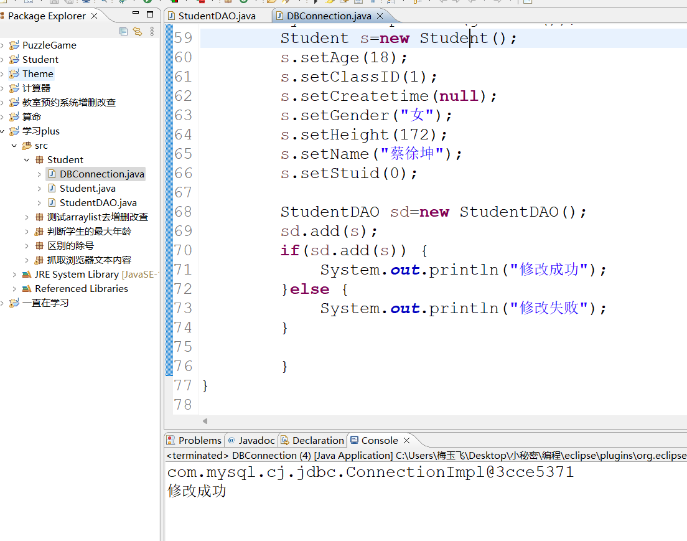
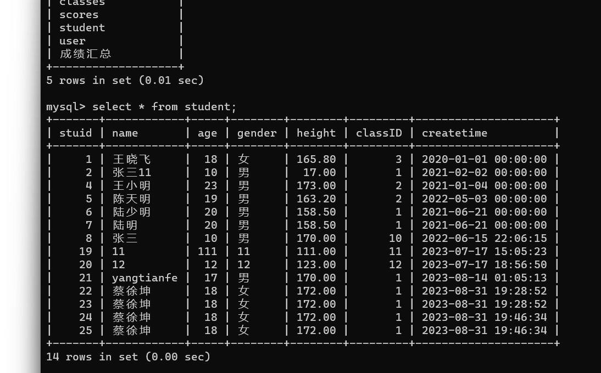

# JAVA数据库的连接

[TOC]


##  一、创建一个学生Student的类名

```
public class Student {
	//属性
	private int stuid;
	private String name;
	private int age;
	private String gender;
	private double height;
	private int classID;
	private Date createtime;
	
	//访问方法的生成,自己去一键生成
	public int getStuid() {
		return stuid;
	}
	public void setStuid(int stuid) {
		this.stuid = stuid;
	}
	public String getName() {
		return name;
	}
	public void setName(String name) {
		this.name = name;
	}
	public int getAge() {
		return age;
	}
	public void setAge(int age) {
		this.age = age;
	}
	public String getGender() {
		return gender;
	}
	public void setGender(String gender) {
		this.gender = gender;
	}
	public double getHeight() {
		return height;
	}
	public void setHeight(double height) {
		this.height = height;
	}
	public int getClassID() {
		return classID;
	}
	public void setClassID(int classID) {
		this.classID = classID;
	}
	public Date getCreatetime() {
		return createtime;
	}
	public void setCreatetime(Date createtime) {
		this.createtime = createtime;
	}

}
```


##  二、JDBC连接数据库

```
package Student;

import java.sql.Connection;
import java.sql.DriverManager;
import java.sql.PreparedStatement;
import java.sql.ResultSet;
import java.sql.SQLException;

public class DBConnection {
    // 加载jdbc连接mysql驱动
    public final static String driver = "com.mysql.cj.jdbc.Driver";
    // 连接mysql数据库的地址
    public final static String url = "jdbc:mysql://localhost:3306/student";
    // 连接mysql的用户名
    public final static String user = "root";
    // 连接mysql的密码
    public final static String pwd = "13212653820";

    // 静态代码块加载jdbc的驱动
    static {
    	// driver点击用Surround with打印出异常
        try {
            Class.forName(driver);
        } catch (ClassNotFoundException e) {
            e.printStackTrace();
        }
    }

    // 获取连接对象
    public static Connection getConn() {
        try {
            return DriverManager.getConnection(url, user, pwd);
        } catch (SQLException e) {
            e.printStackTrace();
        }
        return null;
    }

    // 关闭连接,保证mysql的资源释放,能够充分运用
    public static void close(ResultSet rs, PreparedStatement ps, Connection conn) {
        try {
            if (rs != null) {
                rs.close();
            }
            if (ps != null) {
                ps.close();
            }
            if (conn != null) {
                conn.close();
            }
        } catch (SQLException e) {
            e.printStackTrace();
        }
    }

    // 验证jdbc类的使用
    public static void main(String[] args) {
    	System.out.println(getConn());
    	Student s=new Student();
    	s.setAge(18);
    	s.setClassID(1);
    	s.setCreatetime(null);
    	s.setGender("女");
    	s.setHeight(172);
    	s.setName("蔡徐坤");
    	s.setStuid(0);
    	
    	StudentDAO sd=new StudentDAO();
    	sd.add(s);
    	if(sd.add(s)) {
    		System.out.println("修改成功");
    	}else {
    		System.out.println("修改失败");
    	}
    	
    	}
}

```


###  验证连接

连接成功后会出现下面的英文数字



##  三、创建StudentDAO

```
package Student;


import java.sql.PreparedStatement;
import java.sql.SQLException;
import java.sql.Connection;

public class StudentDAO {
	// 新增数据到数据库
	public boolean add(Student stu) {
		// 执行增删改查的sql语句
		// 1.连接mysql
		Connection conn = DBConnection.getConn();

		// 2.预编译sql执行
		String sql = "insert into student values(null,?,?,?,?,?,now())";

		try {
			PreparedStatement ps = conn.prepareStatement(sql);
			ps.setString(1, stu.getName());
			ps.setInt(2, stu.getAge());
			ps.setString(3, stu.getGender());
			ps.setDouble(4, stu.getHeight());
			ps.setInt(5, stu.getClassID());
			// 执行操作更改
			boolean result = ps.executeUpdate() > 0;
			// 关闭数据库
			DBConnection.close(null, ps, conn);
			return result;
		} catch (SQLException e) {
			// TODO Auto-generated catch block
			e.printStackTrace();
		}
		return false;
	}
}

```


## 四、运行JDBC类

利用一个boolean方法去调用

boolean会把更新的行数进行一个统计，如果大于0，就返回true


2.看数据库中的内容有没有更新




