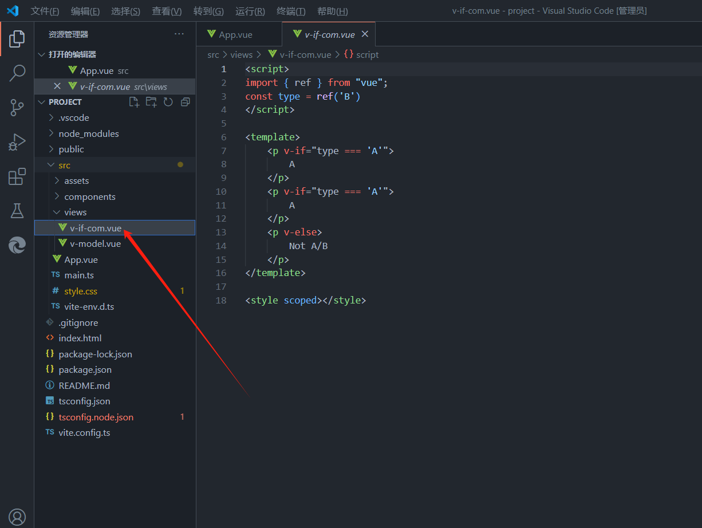
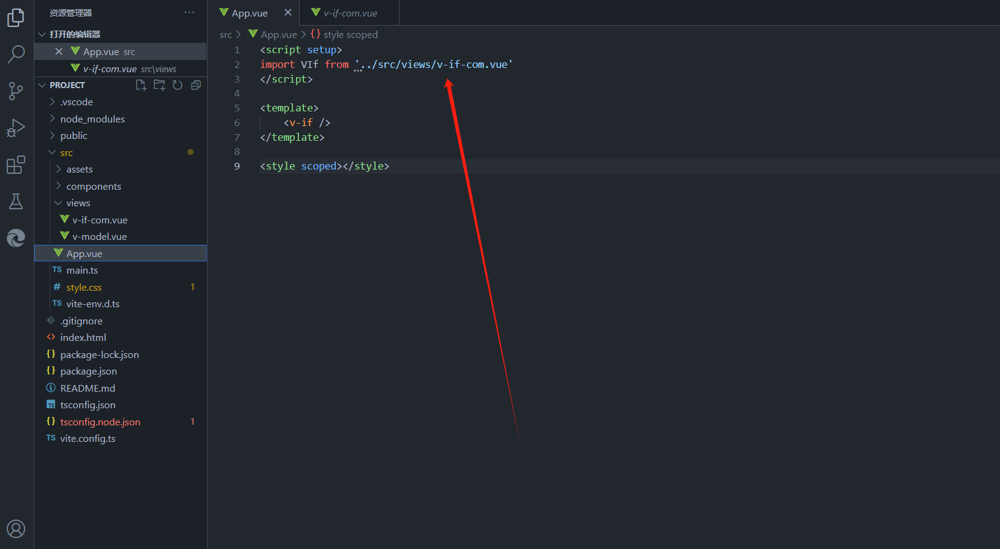

vue创建项目流程

## 1.初始vue cli

Vue CLI 是一个基于 Vue.js 进行快速开发的完整系统，提供：

通过 @vue/cli 实现的交互式的项目脚手架。
通过 @vue/cli + @vue/cli-service-global 实现的零配置原型开发。
一个运行时依赖 (@vue/cli-service)，该依赖：
可升级；
基于 webpack 构建，并带有合理的默认配置；
可以通过项目内的配置文件进行配置；
可以通过插件进行扩展。
一个丰富的官方插件集合，集成了前端生态中最好的工具。
一套完全图形化的创建和管理 Vue.js 项目的用户界面。
概述
单页Web应用（single page web application，SPA），就是只有一张Web页面的应用，是加载单个HTML 页面并在用户与应用程序交互时动态更新该页面的Web应用程序。
在vue的spa中，需要编写vue文件。
Vue提供单文件组件（扩展名为 .vue的文件），每一个vue文件由3部分组成：
模板（html代码）：<template>
脚本（js代码）：<script>
样式（css代码）：<style>
就是只有一张HTML页面 所有的页面跳转都在这个HTML里面 局部刷新

## 2.使用vue cli构建项目

### 安装node.js [安装vue](https://so.csdn.net/so/search?q=安装vue&spm=1001.2101.3001.7020).cli 必须先安装node.js (官方网站[Node.js (nodejs.org)](https://nodejs.org/en))

## 3. 安装和卸载vue cli(命令安装)

1.安装

```bom
npm install -g @vue/cli
```

2.卸载

```bom
cnpm  uninstall  @vue/cli -g
npm   uninstall @vue/cli -g
```


##   4.创建项目

```bom
vue create 项目名
```

## 5.根据需求选择

 步骤1：在这里选择手动配置


步骤2：上下键控制 空格选择 这里选择Babel转码器 Router Vuex


选择的相关内容

```
 ? Check the features needed for your project: (Press <space> to select, <a> to toggle all, <i> to invert selection)
>( ) Babel //转码器，可以将ES6代码转为ES5代码，从而在现有环境执行。
( ) TypeScript// TypeScript是一个JavaScript（后缀.js）的超集（后缀.ts）包含并扩展了 JavaScript 的语法，需要被编译输出为 JavaScript在浏览器运行，目前较少人再用
( ) Progressive Web App (PWA) Support// 渐进式Web应用程序
( ) Router // vue-router（vue路由）
( ) Vuex // vuex（vue的状态管理模式）
( ) CSS Pre-processors // CSS 预处理器（如：less、sass）
( ) Linter / Formatter // 代码风格检查和格式化（如：ESlint）
( ) Unit Testing // 单元测试（unit tests）
( ) E2E Testing // e2e（end to end） 测试 
————————————————

                            版权声明：本文为博主原创文章，遵循 CC 4.0 BY-SA 版权协议，转载请附上原文出处链接和本声明。
                        
原文链接：https://blog.csdn.net/weixin_45481821/article/details/123117835
```

步骤3：选择版本 2.x


  步骤4：是否开启history模式 选择否


 步骤6：选择你想把你的配置文件放在一个独立的配置文件中？还是放到package.json中？

 选择package.json即可 没多大区别


​    步骤7：询问你是否保存以上设置 方便下次选择 这里选择 否 如果选择是 下面还要给你的配      置 取个名字


  步骤8：cd 进入项目 npm run serve 启动项目 

  步骤9：出现两个地址 按住Ctrl键 点击 出现下面页面 项目创建成功 


## 6.开启http-server服务

1.进入项目,cd projectname

```bom
cd project
```

2.安装pnpm,安装生成环境

```bom
pnpm build
```

3.安装http-server

```bom
npm install --global http-server
```

4.运行http-server

```
进入 cd dist
开启 http-server服务
```

## 7.一些报错积累

## **1.错误场景：**

在使用`npm install` 安装插件出现错误
[](https://img-blog.csdnimg.cn/img_convert/f35cc0d542247f1198a3ae9852ddd8c5.png)

## 2.失败原因：

**权限不足**

## **3.解决方法：**

将Node.js的安装目录设置成完全控制。
[](https://img-blog.csdnimg.cn/img_convert/b6a012e8f2f8c785a833cbc3b206a514.png)

> 如果设置了在VSCode还是无法下载，就以管理员的身份进入CMD后。找到项目的根目录，运行`npm install`

[](https://img-blog.csdnimg.cn/img_convert/e172ff3b9954e91a6e499c7343bd1cce.png)
[](https://img-blog.csdnimg.cn/img_convert/e99d149486ff321a6965a7e2e0336875.png)

成功
[](https://img-blog.csdnimg.cn/img_convert/7d978702b1a3f014cfbc487866000353.png)

# 4.脚手架(vite)

全局安装vite

```
npm install vite -g
```


打开`Vue.js`官网:[https://cn.vuejs.org/](https://link.zhihu.com/?target=https%3A//cn.vuejs.org/)，我们会发现`Vue 2` 将于 2023 年 12 月 31 日停止维护


vue2停止维护

虽然`Vue2`的项目还不少，但是官方尤大大都在拥抱`Vue3`。

那我们也不能落后啊，今天就来说说怎么创建第一个`Vue3`项目。

并安装Element Plus 及一些常用配置，实现如下简单增删改查页面


### **一、工具简介**

> 这里我们简单介绍一下文章中使用到的工具，使用这些工具可以提高我们开发效率。
> 当然了只有`nodejs` 是必须要安装的，`nvm `、`Vite` 、`NRM` 这些都不是必须的，

### **1.1 `nvm nodejs`管理工具**

`nvm`全名`node.js version management`，顾名思义是一个`nodejs`的版本管理工具。

通过它可以**安装**和**切换**不同版本的`nodejs`

### **1.2 `node.js` js运行环境**

`Node.js` 就不用多说了，官方解释：`Node.js` is an open-source, cross-platform JavaScript runtime environment. 翻译过来：`Node.js`是一个开源、跨平台的JavaScript运行时环境。

### **1.3 `Vite` 前端构建工具**

Vite是尤雨溪团队开发的，官方称是下一代新型前端构建工具，能够显著提升前端开发体验。

上面称是下一代，当前一代当然是我们熟悉的webpack

Vite 优势

- 开发环境中，无需打包操作，可快速的冷启动。
- 轻量快速的热重载（HMR）。
- 真正的按需编译，不再等待整个应用编译完成。

Vite 官网：[https://cn.vitejs.dev/](https://link.zhihu.com/?target=https%3A//cn.vitejs.dev/)

### **1.4 `NRM`镜像管理工具**

`nrm` 全称是：（npm registry manager） 是`npm`的镜像管理工具

有时候国外的资源太慢，使用它就可以快速地在`npm`镜像源间快速切换

### **二、安装上面工具**

### **2.1 nvm 安装与使用**

### **2.1.1 nvm下载**

①github下载 [https://github.com/coreybutler/nvm-windows/releases](https://link.zhihu.com/?target=https%3A//github.com/coreybutler/nvm-windows/releases)


GitHub下载nvm

②百度网盘下载

有的小伙伴可能打开GitHub网站比较忙，贴心的我帮大家准备了百度网盘下载

链接：[https://pan.baidu.com/s/18FZuhmw7OCFeLFpQmf7u6w](https://link.zhihu.com/?target=https%3A//pan.baidu.com/s/18FZuhmw7OCFeLFpQmf7u6w) 提取码：lnaf

### **2.1.2 nvm 安装**

① 双击nvm-setup.exe可执行文件


双击可执行文件

② 选择nvm安装路径


③选择nodejs安装路径


④安装


⑤检查是否安装成功

```text
C:\Users\xiezhr>nvm version
1.1.9
```

⑥ nvm 常用命令

```text
# 显示可以安装的所有nodejs版本
nvm list available 
 # 安装指定版本的nodejs
nvm install <version> 
# 显示已安装版本列表
nvm list
# 使用指定版本node
nvm use [version]
# 卸载指定版本node
nvm uninstall <version>
```

### **2.2 nodejs安装**

### **2.2.1 nodejs官网**

官网： [https://nodejs.org/en/](https://link.zhihu.com/?target=https%3A//nodejs.org/en/)


nodejs官网

### **2.2.2 查看nodejs 所有版本**

上一小节中安装好的nvm，既然nvm是nodejs管理工具，我们这里就是用nvm 查看node.js 版本，安装nodejs

① **nvm list available** 查看版本

```text
C:\Users\xiezhr>nvm list available
|   CURRENT    |     LTS      |  OLD STABLE  | OLD UNSTABLE |
|--------------|--------------|--------------|--------------|
|   18.10.0    |   16.17.1    |   0.12.18    |   0.11.16    |
|    18.9.1    |   16.17.0    |   0.12.17    |   0.11.15    |
|    18.9.0    |   16.16.0    |   0.12.16    |   0.11.14    |
|    18.8.0    |   16.15.1    |   0.12.15    |   0.11.13    |
|    18.7.0    |   16.15.0    |   0.12.14    |   0.11.12    |
|    18.6.0    |   16.14.2    |   0.12.13    |   0.11.11    |
|    18.5.0    |   16.14.1    |   0.12.12    |   0.11.10    |
|    18.4.0    |   16.14.0    |   0.12.11    |    0.11.9    |
|    18.3.0    |   16.13.2    |   0.12.10    |    0.11.8    |
|    18.2.0    |   16.13.1    |    0.12.9    |    0.11.7    |
|    18.1.0    |   16.13.0    |    0.12.8    |    0.11.6    |
|    18.0.0    |   14.20.1    |    0.12.7    |    0.11.5    |
|    17.9.1    |   14.20.0    |    0.12.6    |    0.11.4    |
|    17.9.0    |   14.19.3    |    0.12.5    |    0.11.3    |
|    17.8.0    |   14.19.2    |    0.12.4    |    0.11.2    |
|    17.7.2    |   14.19.1    |    0.12.3    |    0.11.1    |
|    17.7.1    |   14.19.0    |    0.12.2    |    0.11.0    |
|    17.7.0    |   14.18.3    |    0.12.1    |    0.9.12    |
|    17.6.0    |   14.18.2    |    0.12.0    |    0.9.11    |
|    17.5.0    |   14.18.1    |   0.10.48    |    0.9.10    |

This is a partial list. For a complete list, visit https://nodejs.org/en/download/releases
```

② **nvm install [version]** 安装我们需要的版本

```text
# 安装16.17.1版本
C:\Users\xiezhr>nvm install 16.17.1
Downloading node.js version 16.17.1 (64-bit)...
Extracting...
Complete

Installation complete. If you want to use this version, type
nvm use 16.17.1
```

### **2.2.3 使用指定版本的nodejs**

> 如果我们在日常开发中用到多个版本的`nodejs`,我们电脑上也安装了多个版本的`nodejs`
> 这时候，我们就可以使用如下命令切换`nodejs`版本

```text
C:\WINDOWS\system32>nvm use 16.17.1
Now using node v16.17.1 (64-bit)
```

**小提示：在执行上面命令中可能会报如下错，只需要将cmd切换到管理员登录即可解决**


报错提示

### **2.2.4 查看当前nodejs版本**

> 当我们按照上面的方法切换了`nodejs`版本后，可以用如下命令查看当前`nodejs`版本信息

```text
# 查看node版本
C:\Users\xiezhr>node -v
v16.17.1
# 查看npm版本
C:\Users\xiezhr>npm -v
8.15.0
```

### **2.3 镜像管理工具NRM 安装**

### **2.3.1 安装NRM**

> 输入`npm install -g nrm` 后回车即可全局安装`NRM`镜像管理工具

```text
C:\Users\xiezhr>npm install -g nrm
npm WARN deprecated uuid@3.4.0: Please upgrade  to version 7 or higher.  Older versions may use Math.random() in certain circumstances, which is known to be problematic.  See https://v8.dev/blog/math-random for details.
npm WARN deprecated har-validator@5.1.5: this library is no longer supported
npm WARN deprecated request@2.88.2: request has been deprecated, see https://github.com/request/request/issues/3142

added 58 packages in 6s
npm notice
npm notice New minor version of npm available! 8.15.0 -> 8.19.2
npm notice Changelog: https://github.com/npm/cli/releases/tag/v8.19.2
npm notice Run npm install -g npm@8.19.2 to update!
npm notice
```

### **2.3.2 nrm镜像管理工具使用**

> 我们可以通过如下常用nrm命令管理npm镜像

```text
# 查看镜像列表
nrm ls
# 查看当前使用的镜像
nrm current 
# 添加镜像
nrm add <名称> <远程地址或私服地址>
# 删除镜像
nrm del <名称>
# 切换镜像
nrm use <名称> 
# 测试镜像网络传输速度
nrm test <名称>
# 查看nrm版本号
nrm <-version | -V> 
# 查看nrm相关信息
nrm <-help | -h>
# 打开镜像主页
nrm home <名称> [browser]
# 上传npm包或命令程序
nrm publish [<tarball>|<folder>]
```

查看镜像列表


image-20230902110743824

### **三、创建Vue3项目**

> 我们到官网 [https://cn.vitejs.dev/guide/](https://link.zhihu.com/?target=https%3A//cn.vitejs.dev/guide/) 根据官网一步步往下走即可

**兼容性注意：**Vite 需要 **[Node.js](https://link.zhihu.com/?target=https%3A//nodejs.org/en/)** 版本 14.18+，16+。

然而，有些模板需要依赖更高的 Node 版本才能正常运行，当你的包管理器发出警告时，请注意升级你的 Node 版本。


一、先安装Vite

```
npm install vite -g
```

① 使用`npm` 、`yarn `、`pnpm` 其中一种命令安装即可

> `pnpm` 是集合了`npm` 和`yarn` 优点的，在使用前需要先安装

使用 `NPM`:

```text
 npm create vite@latest
```

使用 `Yarn`:

```text
 yarn create vite
```

使用 `PNPM`:

```text
 pnpm create vite
```

③选择使用哪种框架，这里我们当然是选择Vue 了

> Vite 不仅仅支持Vue 框架，还支持React、Vanilla、Lit 等前端主流框架


选择Vue框架

④ 选择Javascript 和TypeScript

> Vue3 已经全面拥抱TypeScript，所以这里我们就选择TypeScript


选择TypeScript

⑤ 到此我们就创建完成了，是不是很简单了


构建完成

⑥ 我们按照上面提示，进入到 vite-project 项目路径下 按照依赖

```text
# 切换到项目跟目录
cd vite-project
# 安装依赖
npm install
```


安装依赖

⑦ 启动Vue 项目

> 输入如下命令启动我们创建好的Vue项目

```text
# 启动项目
npm run dev
```

当控制台看到如下所示，说明启动成功了


启动成功

浏览器打开 [http://127.0.0.1:5173/](https://link.zhihu.com/?target=http%3A//127.0.0.1%3A5173/)


浏览器打开

### **四、项目结构介绍**

> 通过Vite创建好的Vue 项目机构如下所示

### **4.1 项目结构**


Vue项目目录

里面需要重点关注的，我用小红旗和小星星标注了


项目结构说明

### **4.2 index.html**

首页文件的初始代码如下：

```text
<!doctype html>
<html lang="en">
  <head>
    <meta charset="UTF-8" />
    <link rel="icon" type="image/svg+xml" href="/vite.svg" />
    <meta name="viewport" content="width=device-width, initial-scale=1.0" />
    <title>Vite + Vue + TS</title>
  </head>
  <body>
    <div id="app"></div>
    <script type="module" src="/src/main.ts"></script>
  </body>
</html>
```

这就是一个普普通通的`html`文件，让它与众不同的是`<div id="app"></div>`

整个项目只有这一个` html` 文件，所以这是一个 **单页面应用**，当我们打开这个应用，表面上可以有很多页面，实际上它们都只不过在一个 div 中

# 5.项目集合(组件化)

1.先把项目写好



2.再用一个import去导入

**import的后面一定要大写**,然后还要连续


