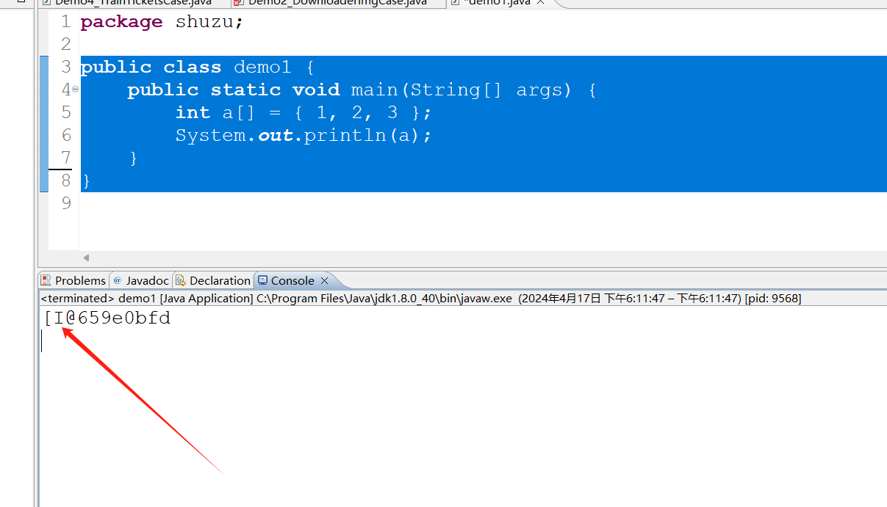
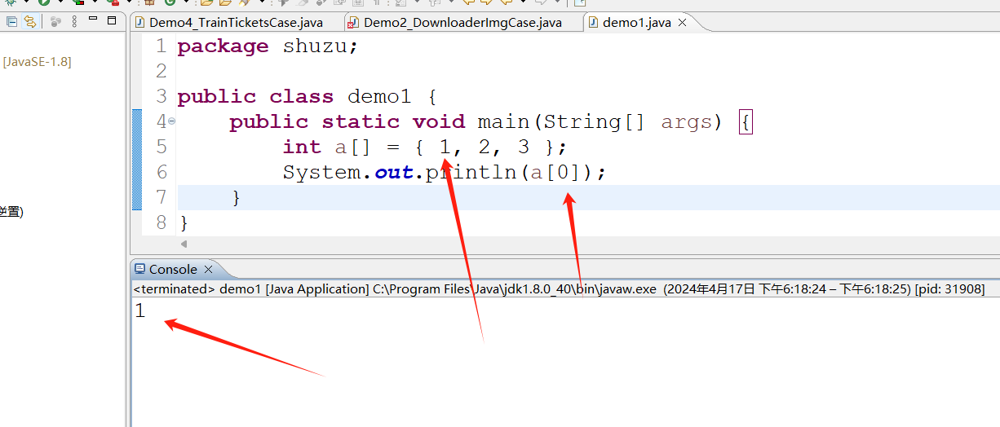

### 数组

#### 数组的定义


> 数组是一种数据结构，用来储存同一类型的集合。通过一个整型下标可以访问数组中的每一个值。

```java
public class demo1 {
	public static void main(String[] args) {
		int a[] = { 1, 2, 3 };
		System.out.println(a);
	}
}
```

直接打印是不会出值,他会出现一段**地址值和数组类型**




I@659e0bfd  

- **i** 代表的是数组类型也就是 int
- @ 后面代码的是地址值


#### 输出某一个字段的值



数组是一个从零开始的容器,一定要用**[]**去表示字段。


#### 数组最大值

利用强调for循环去实现

```java
public class demo1 {
	public static void main(String[] args) {
		int a[] = { 1, 2, 3 };
		int max = a[0];
		for (int num : a) {
			if (num > max) {
				max = num;
			}
		}
		System.out.println(max);
	}
}

```


### 二维数组

在Java中，二维数组也是通过行和列索引来访问其元素的。Java的二维数组可以是静态的（即大小在声明时确定），也可以是动态的（即可以在运行时改变大小）。下面是一些关于Java中二维数组的基础知识：

**1. 声明和初始化**

你可以在声明时初始化二维数组，也可以分别声明和初始化。

```java
// 静态初始化，声明并初始化一个3x4的二维数组  
int[][] staticArray = {  
    {1, 2, 3, 4},  
    {5, 6, 7, 8},  
    {9, 10, 11, 12}  
};  
  
// 动态初始化，先声明再分配空间  
int[][] dynamicArray = new int[3][4];  
  
// 也可以只初始化外部数组，然后逐个初始化内部数组  
int[][] jaggedArray = new int[3][];  
jaggedArray[0] = new int[]{1, 2, 3};  
jaggedArray[1] = new int[]{4, 5};  
jaggedArray[2] = new int[]{6, 7, 8, 9, 10}; // 内部数组可以有不同的大小
```

**2. 访问元素**

使用两个索引（一个用于行，一个用于列）来访问二维数组中的元素。

```java
java复制代码

int element = staticArray[0][1]; // 访问第一行第二列的元素，值为2
```

**3. 遍历数组**

使用嵌套的for循环来遍历二维数组中的每个元素。

```java
for (int i = 0; i < staticArray.length; i++) {  
    for (int j = 0; j < staticArray[i].length; j++) {  
        System.out.print(staticArray[i][j] + " ");  
    }  
    System.out.println(); // 换行  
}
```

**4. 修改元素**

你可以像访问元素一样来修改二维数组中的元素。

```java
java复制代码

staticArray[0][1] = 100; // 修改第一行第二列的元素为100
```

**5. 不规则数组（Jagged Array）**

在Java中，你还可以创建不规则数组（也称为锯齿数组），其内部数组可以有不同的大小，如上面`jaggedArray`示例所示。

**6. 数组长度**

对于二维数组，`array.length`将给出外部数组（即行）的长度。要获取特定行的长度，你需要使用`array[rowIndex].length`。

```java
int rows = staticArray.length; // 获取行数  
int cols = staticArray[0].length; // 获取第一列的元素数量（假设所有行都有相同的列数）
```

请注意，对于不规则数组，每一行的长度可能不同，所以你需要针对每一行单独获取其长度。

**7. 数组作为参数传递**

在Java中，数组可以作为参数传递给方法。二维数组也可以这样做。

```java
public static void printArray(int[][] array) {  
    for (int i = 0; i < array.length; i++) {  
        for (int j = 0; j < array[i].length; j++) {  
            System.out.print(array[i][j] + " ");  
        }  
        System.out.println();  
    }  
}
```

然后你可以这样调用这个方法：

```java
java复制代码

printArray(staticArray);
```

这些是Java中二维数组的一些基础知识。在实际编程中，二维数组是非常有用的数据结构，用于表示表格数据、矩阵运算、图像处理等多种场景。